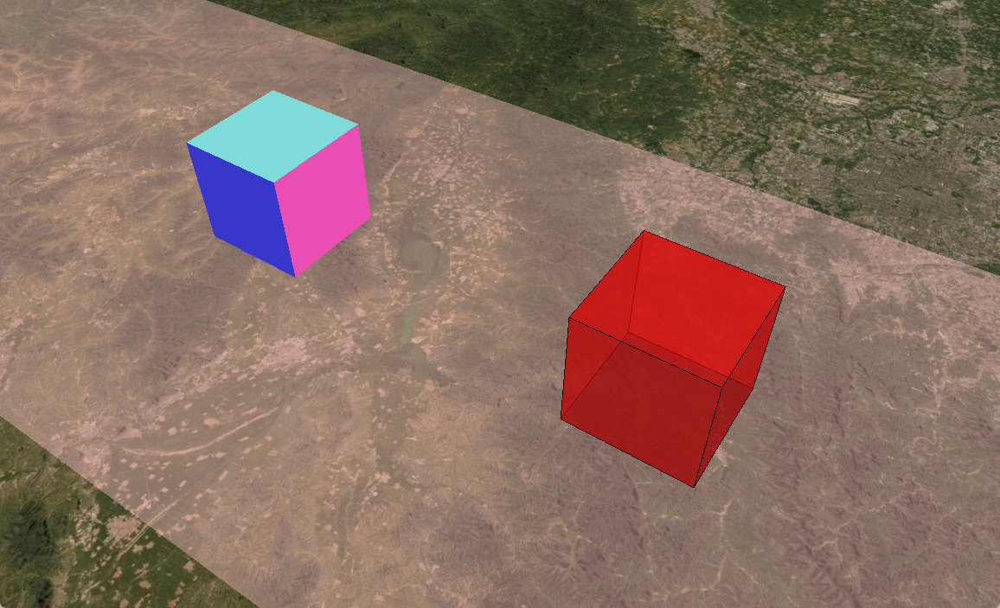

# Cesium-Three

截止2022年7月30日，最新的Cesium-Three整合示例，基于如下版本：

- Cesium 1.95：[Release CesiumJS 1.95 · CesiumGS/cesium (github.com)](https://github.com/CesiumGS/cesium/releases/tag/1.95)
- Three 143：[Release r143 · mrdoob/three.js (github.com)](https://github.com/mrdoob/three.js/releases/tag/r143)

# 屏幕截图



# 参考资料

- 实现原理：https://cesium.com/blog/2017/10/23/integrating-cesium-with-threejs/
- 代码示例：https://github.com/CesiumGS/cesium-threejs-experiment

# 改动说明

Cesium官方提供的示例程序“[cesium-threejs-experiment](https://github.com/CesiumGS/cesium-threejs-experiment)”中使用的版本如下：

- Cesium ^1.45.0

- Three 0.87.1

显然，这在现在是过时的，若用最新的Cesium和Three版本直接套用原来的代码，会出现如下问题：

- Cesium初始化无法找到容器

- Three场景无法正确的显示，加载的模型在场景中找不到

解决方法如下，注释`initCesium()`方法中Cesium初始化选项`creditContainer : "hidecredit"`，可以解决Cesium初始化时无法找到容器的问题：

```javascript
function initCesium() {
  cesium.viewer = new Cesium.Viewer(cesiumContainer, {
    // creditContainer : "hidecredit", // Cannot read properties of null (reading 'appendChild')
  })
}
```

去除`renderThreeObj()`方法中的`three.camera.lookAt(new THREE.Vector3(0,0,0));`语句，并在配置Three相机矩阵之前添加`three.camera.lookAt(0, 0, 0)`：

```javascript
function renderThreeObj() {
  three.camera.lookAt(0, 0, 0) // here
  three.camera.matrixWorld.set(...)
  three.camera.matrixWorldInverse.set(...)
  // three.camera.lookAt(new THREE.Vector3(0,0,0));
}
```

同时，需要给Three容器添加如下CSS样式：

```css
#ThreeContainer canvas {
  pointer-events: none;
  position: absolute;
  top: 0;
}
```